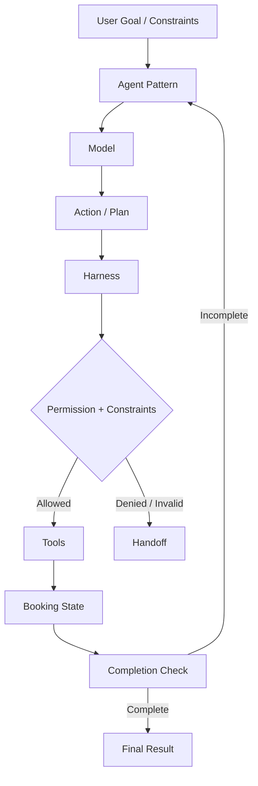

<p align="center">
  <a href="https://www.uit.edu.vn/" title="Trường Đại học Công nghệ Thông tin" style="border: none;">
    
  </a>
</p>
<h1 align="center">SE373 - KỸ THUẬT XÂY DỰNG HỆ THỐNG AGENTIC AI</h1>

# FLIGHT AGENT


> Project xây dựng một **Flight Agent** mô phỏng quy trình đặt vé máy bay. Hệ thống sử dụng LangChain để kết nối Model với Tool, đồng thời dùng một lớp **Harness** để kiểm soát các ràng buộc, quyền thực thi, điều kiện hoàn thành, Handoff và Trace.
>
> Trong đó, hệ thống triển khai và so sánh ba Agent Pattern chính:
>
> - **ReAct**: Model quyết định từng hành động dựa trên Observation mới nhất.
> - **Plan-then-Execute**: Model tạo toàn bộ Plan trước, sau đó hệ thống thực thi tuần tự.
> - **Hybrid**: Kết hợp Plan-then-Execute với khả năng Replan khi gặp lỗi có thể phục hồi.
---
## 1. GIỚI THIỆU MÔN HỌC:
| | |
|---|---|
| **Môn học** | Kỹ Thuật Xây Dựng Hệ Thống Agentic AI |
| **Mã lớp** | SE373.R11 |
| **Năm học** | 2026 - 2027 |
| **Sinh viên** | Tô Quốc Thái |
| **MSSV** | 24521598 |
---
## 2. KIẾN TRÚC HỆ THỐNG:

Các nguyên tắc chính:
> + **Model đề xuất, Harness xác minh, Tool thực thi, State thật quyết định Completion.**
> + **Harness chịu trách nhiệm kiểm soát các Side Effect như giữ ghế và thanh toán, thay vì tin trực tiếp quyết định của Model.**
---
## 3. CÁC CHỨC NĂNG CHÍNH:
- Mock flight dataset và booking store.
- Search flight, book seat, pay và get booking.
- Constraints được biểu diễn dưới dạng dữ liệu.
- Permission check trước các hành động có Side Effect.
- Completion Criteria được kiểm chứng bằng code.
- Human Handoff khi thiếu quyền hoặc không thể tiếp tục an toàn.
- Trace từng bước thực thi.
- Hard Limit cho Agent Loop và Replan.
- Loop Detection và kiểm tra Tool Result.
- Ba Agent Pattern: ReAct, Plan-then-Execute và Hybrid.
- Evaluation trên cùng bộ Scenario.
- Demo End-to-End với Google Gemini.
---
## 4. CÔNG NGHỆ SỬ DỤNG:
| Phần | Công nghệ |
|---|---|
| **Ngôn ngữ lập trình** | Python |
| **Agent Framework** | LangChain |
| **LLM Provider** | Google Gemini |
| **Model Integration** | `langchain-google-genai` |
| **Structured Output / Schema** | Pydantic |
| **Environment Configuration** | `python-dotenv` |
| **Testing** | pytest |
---
## 5. CẤU TRÚC DỰ ÁN:
```
SE373-Flight-Agent/
│
├── main.py                        # Application Entry Point, chọn và chạy Agent Pattern
├── requirements.txt               # Danh sách dependency của Project
├── .env.example                   # Mẫu cấu hình API Key và Model
├── .gitignore                     # Loại trừ secret, cache và file không cần commit
├── README.md                      # Tài liệu giới thiệu và hướng dẫn sử dụng
│
├── flight_agent/
│   ├── __init__.py                # Khởi tạo Python package
│   ├── config.py                  # Đọc và kiểm tra cấu hình Environment
│   ├── models.py                  # Domain Model và Flight Constraints
│   ├── tools.py                   # Mock Tool và dữ liệu chuyến bay
│   ├── harness.py                 # Permission, Constraints, Completion và Handoff
│   ├── failure_modes.py           # Loop Detection và kiểm tra Tool Result
│   ├── react_agent.py             # Triển khai ReAct Pattern
│   ├── plan_execute_agent.py      # Triển khai Plan-then-Execute Pattern
│   └── hybrid_agent.py            # Triển khai Hybrid Pattern và Replan
│
├── evaluation/
│   ├── __init__.py                # Khởi tạo Evaluation package
│   ├── scenarios.py               # Định nghĩa các Evaluation Scenario
│   ├── evaluate.py                # Chạy Evaluation và tổng hợp Metric
│   └── results.json               # Kết quả Evaluation đã sinh
│
├── tests/
│   ├── __init__.py                # Khởi tạo Test package
│   ├── test_models.py             # Test Domain Model và Constraints
│   ├── test_tools.py              # Test Mock Tool
│   ├── test_harness.py            # Test Harness và Permission
│   ├── test_agents.py             # Test ba Agent Pattern
│   ├── test_failure_modes.py      # Test các Failure Mode
│   └── test_evaluation.py         # Test Evaluation logic
│
└── report/
    └── report.md                  # Báo cáo kỹ thuật
```
---
## 6. HƯỚNG DẪN CÀI ĐẶT:
### 6.1. Clone Repository

```bash
git clone https://github.com/quocthai912/SE373-Flight-Agent.git
cd SE373-Flight-Agent
```

### 6.2. Tạo Virtual Environment

Windows PowerShell:

```powershell
python -m venv .venv
.venv\Scripts\Activate.ps1
```

Linux/macOS:

```bash
python3 -m venv .venv
source .venv/bin/activate
```

### 6.3. Cài Dependency

```bash
pip install -r requirements.txt
```
---
## 7. CẤU HÌNH MÔI TRƯỜNG:
Tạo file `.env` từ `.env.example`:

```env
API_KEY=your_google_ai_studio_key
FLIGHT_AGENT_MODEL=your_gemini_model_name
```
---
## 8. KHỞI CHẠY FLIGHT AGENT:
Project hỗ trợ ba Pattern trực tiếp từ `main.py`.

### 8.1. ReAct

```bash
python main.py react
```

### 8.2. Plan-then-Execute

```bash
python main.py plan_then_execute
```

### 8.3. Hybrid

```bash
python main.py hybrid
```

Runtime Demo hiện sử dụng bộ Constraints:

```
Origin: SGN
Destination: DAD
Date: 2026-10-07
Depart before: 12:00
Max price: 2,000,000 VND
```
+ Kết quả được in trực tiếp ra Terminal dưới dạng Structured Result, bao gồm trạng thái cuối, Booking và Trace.
---
## 9. FAILURE MODES & SAFEGUARDS:
Hệ thống có các Guard cơ bản cho một số Failure Mode thường gặp:
| Failure Mode | Cơ chế xử lý |
|---|---|
| Infinite Loop | `LoopDetector`, `max_steps` |
| Tool Hallucination | Tool allowlist và kiểm tra Tool tồn tại |
| Goal Drift | Harness kiểm lại Constraints trước Side Effect |
| State Corruption | `validate_tool_result(...)` |
| Permission Denied | Dừng và Handoff |
| Recoverable Plan Failure | Hybrid Replan có giới hạn |
---
## 10. GIẤY PHÉP:
Dự Án Được Thực Hiện Cho Mục Đích Học Thuật - Môn Kỹ Thuật Xây Dựng Hệ Thống Agentic AI (SE373) - Trường Đại Học Công Nghệ Thông Tin ĐHQG.TPHCM (UIT).
