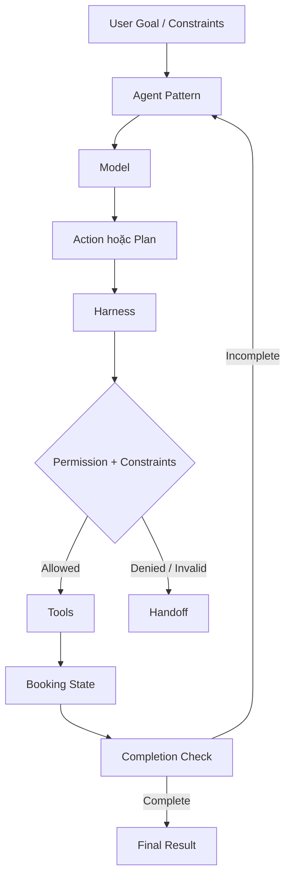

# BÁO CÁO BTVN #3 - XÂY DỰNG FLIGHT AGENT ĐẶT VÉ BẰNG LANGCHAIN

**Môn học:** SE373 - Kỹ thuật xây dựng hệ thống Agentic AI  
**Bài tập:** BTVN #3 - Dựng Agent đặt vé bằng LangChain  
**Họ và tên:** Tô Quốc Thái
**MSSV:** 24521598
**Repository:** `https://github.com/quocthai912/SE373-Flight-Agent`

---

## 1. Giới thiệu

BTVN #3 yêu cầu xây dựng một Agent đặt vé máy bay bằng LangChain, trong đó hệ thống không chỉ gọi mô hình ngôn ngữ để sinh câu trả lời mà phải có Tool, Agent Loop, Harness, điều kiện dừng có thể kiểm chứng và cơ chế Handoff cho con người khi cần.

Theo nội dung Buổi 3 - Agent Fundamentals, bài tập yêu cầu các phần chính:

- Tìm hiểu LangChain và LangGraph.
- Tạo Mock Tool.
- Viết Harness.
- Biểu diễn Constraints dưới dạng dữ liệu.
- Kiểm tra Completion Criteria bằng code.
- Kiểm tra Permission.
- Hỗ trợ Handoff.
- Cài đặt đầy đủ ba Pattern: ReAct, Plan-then-Execute và Hybrid.
- Đánh giá hiệu quả của cả ba Pattern.

Trong bài làm này, em chọn bài toán cụ thể là đặt một vé từ **SGN đến DAD ngày 07/10/2026, khởi hành trước 12:00 và giá không vượt quá 2.000.000 VNĐ**. Mục tiêu không phải mô phỏng toàn bộ hệ thống đặt vé thực tế, mà là tạo một môi trường nhỏ, có thể kiểm soát và có đủ trường hợp đúng/sai để quan sát cách từng Pattern hoạt động.

Điểm em tập trung nhiều nhất là tách rõ vai trò của Model và Harness. Model có thể đề xuất hành động hoặc kế hoạch, nhưng các thao tác tạo Side Effect như đặt ghế và thanh toán phải được code kiểm tra lại trước khi thực hiện.

---

## 2. Yêu cầu và mục tiêu của bài làm

### 2.1. Yêu cầu chức năng

Hệ thống cần hỗ trợ một luồng đặt vé cơ bản:

1. Tìm các chuyến bay theo điểm đi, điểm đến và ngày.
2. Chọn chuyến bay phù hợp.
3. Giữ ghế.
4. Thanh toán.
5. Đọc lại trạng thái đặt chỗ.
6. Xác minh nhiệm vụ thật sự hoàn thành.

Dữ liệu chuyến bay được mô phỏng để có cả trường hợp hợp lệ và không hợp lệ:

| Mã chuyến | Tuyến     | Thời gian        |       Giá | Ý nghĩa trong bài     |
| --------- | --------- | ---------------- | --------: | --------------------- |
| `VN122`   | SGN → DAD | 2026-10-07 08:10 | 1.850.000 | Hợp lệ                |
| `QH118`   | SGN → DAD | 2026-10-07 15:40 | 1.640.000 | Vi phạm giờ khởi hành |
| `VJ604`   | SGN → DAD | 2026-10-07 08:10 | 2.480.000 | Vi phạm giá tối đa    |
| `VN210`   | SGN → DAD | 2026-10-08 09:00 | 1.900.000 | Sai ngày              |
| `VN250`   | SGN → HAN | 2026-10-07 07:30 | 1.700.000 | Sai điểm đến          |

Nhờ dữ liệu này, hệ thống có thể kiểm tra được Happy Path, Constraint Violation, khả năng phục hồi lỗi và các trường hợp cần Handoff.

### 2.2. Yêu cầu an toàn và kiểm chứng

Ngoài việc chạy được, bài làm cần bảo đảm:

- Agent không được tự ý bỏ qua Constraints.
- Agent không được thanh toán khi chưa có Permission.
- Completion phải được kiểm bằng State thật.
- Không tin Booking Data chỉ do Model tự khai.
- Có Hard Limit để tránh chạy vô hạn.
- Có Trace để xem hệ thống đã làm gì ở từng bước.
- Khi không thể tiếp tục an toàn thì Handoff.

### 2.3. Mục tiêu đánh giá

Ba Pattern phải dùng chung:

- Cùng Dataset.
- Cùng Constraints.
- Cùng Tool.
- Cùng Harness.
- Cùng các Scenario đánh giá.

Việc dùng chung phần lõi giúp kết quả so sánh tập trung vào sự khác nhau trong cách tổ chức Agent Loop, thay vì bị ảnh hưởng bởi ba bộ logic nghiệp vụ khác nhau.

---

## 3. Kiến trúc tổng thể

### 3.1. Nguyên tắc kiến trúc

Thiết kế chính của bài có thể tóm tắt bằng ý:

> **Model đề xuất, Harness xác minh, Tool thực thi, State thật quyết định Completion.**

Em không tách ba Pattern thành ba project riêng. Cả ba đều dùng chung phần nghiệp vụ, dữ liệu và khung kiểm soát.



Trong đó:

- `Models.py` chứa Domain Model.
- `Tools.py` chứa dữ liệu và Mock Tool.
- `Harness.py` chứa lớp Harness của Agent và Completion.
- `React_agent.py` triển khai ReAct Agent.
- `Plan_execute_agent.py` triển khai Plan-then-Execute Agent.
- `Hybrid_agent.py` triển khai Hybrid Agent.
- `Failure_modes.py` chứa cơ chế phát hiện một số Failure Mode.
- `Evaluation/` chứa các Scenario, Metric và kết quả đánh giá.
- `Main.py` là Application Entry Point.

### 3.2. Cấu trúc thư mục chính

```text
FLIGHT_AGENT/
│
├── main.py
├── requirements.txt
├── .env.example
│
├── flight_agent/
│   ├── config.py
│   ├── models.py
│   ├── tools.py
│   ├── harness.py
│   ├── failure_modes.py
│   ├── react_agent.py
│   ├── plan_execute_agent.py
│   └── hybrid_agent.py
│
├── evaluation/
│   ├── scenarios.py
│   ├── evaluate.py
│   └── results.json
│
├── tests/
│   ├── test_models.py
│   ├── test_tools.py
│   ├── test_harness.py
│   ├── test_agents.py
│   ├── test_failure_modes.py
│   └── test_evaluation.py
│
└── report/
    └── report.md
```

### 3.3. LangChain và LangGraph trong bài làm

Bài tập yêu cầu tìm hiểu cả LangChain và LangGraph. Trong phần cài đặt hiện tại, em sử dụng trực tiếp các thành phần của LangChain như:

- `BaseChatModel`.
- `StructuredTool`.
- `SystemMessage`, `HumanMessage`, `ToolMessage`.
- `ChatPromptTemplate`.
- `With_structured_output(...)`.
- Tích hợp Google Gemini qua `langchain-google-genai`.

LangGraph đã được tìm hiểu trong phạm vi yêu cầu môn học, tuy nhiên **code hiện tại không dùng LangGraph để điều phối ba Pattern**. Em chủ động giữ vòng lặp bằng Python để có thể nhìn rõ từng bước, điều kiện dừng, Trace, Handoff và khác biệt giữa ba Pattern.

---

## 4. Domain Model, Mock Tool và Harness

### 4.1. Domain Model

File `flight_agent/models.py` có ba lớp chính.

#### `Flight`

Đại diện cho một chuyến bay:

- `Flight_number`.
- `Origin`.
- `Destination`.
- `Depart_at`.
- `Price`.

`Flight` là `dataclass(frozen=True)` vì dữ liệu chuyến bay mô phỏng không cần thay đổi sau khi khởi tạo.

#### `Booking`

Đại diện cho một lượt đặt chỗ:

- `Code`.
- `Flight`.
- `Seat`.
- `Paid`.

`Booking` không sử dụng `(frozen=True)` vì `paid` cần thay đổi từ `False` sang `True` sau khi thanh toán.

#### `FlightConstraints`

Lưu toàn bộ Constraints của người dùng:

- Điểm đi.
- Điểm đến.
- Ngày.
- Thời gian khởi hành tối đa.
- Giá tối đa.

Phương thức `is_satisfied_by(...)` kiểm toàn bộ Constraints bằng code. Đây là phần hiện thực trực tiếp của ý tưởng **Constraints as Data**.

Một điểm quan trọng là Model có thể đọc Constraints qua `to_prompt()`, nhưng quyết định cuối cùng một chuyến bay có hợp lệ hay không vẫn do code trong `is_satisfied_by(...)` xác minh.

---

### 4.2. Mock Tool

File `flight_agent/tools.py` mô phỏng bốn Tool:

#### `search_flights`

Tìm chuyến bay theo:

- `Origin`.
- `Destination`.
- `Date`.

Tool này không tự kiểm toàn bộ `depart_before` và `max_price`. Việc này được thiết kế có chủ đích để Harness chịu trách nhiệm xác minh đầy đủ Constraints.

#### `book_seat`

Nhận `flight_number`, tự tra cứu lại chuyến bay trong dữ liệu chuẩn và tạo Booking với:

- Mã đặt chỗ.
- Số ghế.
- `Paid=False`.

Agent chỉ cần đề xuất mã chuyến, còn Tool đọc lại Canonical Data trong hệ thống.

#### `pay`

Nhận `booking_code`, đọc Booking trong `BOOKINGS` và cập nhật `paid=True`.

#### `get_booking`

Đọc lại State đặt chỗ mà không tạo Side Effect. Tool này rất quan trọng cho Read-back Verification và Completion Check.

Booking Store hiện chỉ là dictionary trong bộ nhớ. Hàm `reset_booking_store()` được dùng để giữ các Test và lần Demo độc lập với nhau.

---

### 4.3. Harness

File `flight_agent/harness.py`:

`FlightAgentHarness` giữ hai nhóm thông tin:

- `FlightConstraints`: nhiệm vụ cần đạt.
- `AgentPermissions`: quyền hiện tại của Agent.

#### Kiểm tra Constraints

`check_constraints(flight_number)` tự tìm lại chuyến bay thật trong `FLIGHTS`, sau đó gọi `FlightConstraints.is_satisfied_by(...)`.

Kết quả có thể là:

- `Satisfied`.
- `Constraint_violation`.
- `Not_found`.

Như vậy, nếu Model chọn `VJ604` vì giờ bay đẹp nhưng giá 2.480.000 VNĐ, Harness vẫn chặn được trước khi đặt chỗ.

#### Kiểm tra Permission

Hai Permission đang được mô phỏng:

- `Allow_booking`.
- `Allow_payment`.

`execute_book_seat(...)` kiểm Permission và Constraints trước khi gọi Tool thật.

`execute_pay(...)` còn kiểm thêm Booking State và Constraints của chuyến bay đã được giữ ghế trước khi cho thanh toán.

Thiết kế này tạo một lớp Defense in Depth: ngay cả khi State không hợp lệ xuất hiện do đường đi khác, bước thanh toán vẫn sẽ kiểm tra lại.

#### Completion Criteria

`check_completion(booking_code)` không hỏi Model rằng “đã xong chưa”. Hàm đọc lại Booking và kiểm:

1. Booking tồn tại.
2. Chuyến bay vẫn thỏa Constraints.
3. `Paid=True`.

Chỉ khi cả ba điều kiện đều đúng, hệ thống mới trả `status="complete"`.

Điểm này bám sát nội dung Buổi 3: Completion Criteria nên là quy tắc khách quan có thể kiểm bằng code, không phụ thuộc vào việc Model tự tuyên bố đã hoàn thành.

#### Handoff

Khi hệ thống không thể tiếp tục an toàn, `create_handoff(...)` tạo dữ liệu gồm:

- Lý do.
- Các hành động đã thử.
- Side Effect đã xảy ra.
- Constraints hiện tại.
- Booking State, nếu có.
- Câu hỏi cụ thể cần con người quyết định.

---

## 5. Ba Pattern của Agent

### 5.1. ReAct

ReAct được triển khai trong `flight_agent/react_agent.py`.

Luồng chính:

```text
Model chọn một Tool
        ↓
Code thực thi Tool
        ↓
nhận Observation
        ↓
đưa Observation lại cho Model
        ↓
Model chọn bước tiếp theo
```

Trong mỗi vòng:

1. Model nhận Context.
2. Model đề xuất đúng một Tool Call.
3. Code thực thi.
4. Observation được thêm lại vào Context.
5. Trace được ghi.
6. Nếu đã có Booking, Harness kiểm Completion.
7. Nếu chưa xong thì tiếp tục vòng sau.

Các Side-effect Tool không được Model gọi trực tiếp:

- `Book_seat` phải đi qua `harness.execute_book_seat`.
- `Pay` phải đi qua `harness.execute_pay`.

ReAct có ưu điểm là có thể thay đổi hướng đi sau mỗi Observation. Ví dụ trong Test, Agent thử `VJ604`, nhận `constraint_violation`, sau đó chuyển sang `VN122`.

Nhược điểm là số lần gọi Model tăng theo số vòng. Ngoài ra, vì Context được nối dài sau từng bước nên chi phí có thể tăng khi tác vụ dài.

Hệ thống đặt `max_steps=7` để có Hard Limit, tránh Agent Loop lặp vô tận.

---

### 5.2. Plan-then-Execute

Plan-then-Execute được triển khai trong `flight_agent/plan_execute_agent.py`.

Khác với ReAct, Model không quyết định từng Tool sau mỗi Observation. Thay vào đó:

1. Hệ thống tìm danh sách chuyến bay.
2. Model tạo toàn bộ Plan.
3. Code kiểm tra Plan.
4. Code thực thi từng bước theo thứ tự.
5. Nếu một bước lỗi thì dừng và Handoff.

Plan có Structured Output bằng Pydantic:

- `PlanStep`.
- `FlightPlan`.

Plan hợp lệ phải có đúng thứ tự:

```text
book_seat
→ pay
→ get_booking
```

Booking Code chưa tồn tại khi lập kế hoạch, nên Model phải dùng Placeholder:

```text
$booking_code
```

Sau khi `book_seat` chạy thật, code mới thay Placeholder bằng Booking Code thật.

Điểm mạnh của Pattern này là Plan có thể nhìn thấy trước khi chạy, dễ kiểm tra và số lần gọi Model thấp.

Tuy nhiên, khi môi trường thay đổi hoặc một bước đầu tiên thất bại, Plan-then-Execute không tự thích nghi. Trong bài này, Agent sẽ dừng và Handoff, không tự Replan.

---

### 5.3. Hybrid

Hybrid được triển khai trong `flight_agent/hybrid_agent.py` và kế thừa `PlanThenExecuteFlightAgent`.

Ý tưởng là giữ ưu điểm của Plan nhưng thêm khả năng Replan khi quan sát cho thấy Plan hiện tại không còn phù hợp.

Luồng chính:

```text
Initial Plan
    ↓
Execute
    ↓
Observation lỗi có thể phục hồi?
    ├── Không → Handoff
    └── Có
         ↓
       Replan
         ↓
       Execute lại
```

Trong bài, Replan chỉ xảy ra nếu đồng thời:

- Chưa có Booking Code.
- Bước lỗi là `book_seat`.
- Lỗi thuộc nhóm `constraint_violation` hoặc `not_found`.

Permission Denied **không** được xem là lỗi cần Replan. Nếu thiếu quyền, Agent phải Handoff, vì lập một Plan khác không được phép dùng để né chính sách quyền.

Ngoài ra, sau khi Booking đã được tạo, hệ thống không tự Replan. Quyết định này nhằm tránh tạo nhiều Side Effect khó kiểm soát.

`max_replans` mặc định bằng `2`, nên Hybrid cũng có Hard Limit.

Để dễ Debug, Trace của Hybrid có thêm:

- `Plan_number`.
- `Plan_history`.
- `Replan_count`.

---

## 6. Failure Mode và cơ chế bảo vệ

Bài làm kiểm tra bốn Failure Mode chính được trình bày trong Buổi 3:

1. Infinite Loop.
2. Tool Hallucination.
3. Goal Drift.
4. State Corruption.

### 6.1. Infinite Loop

`LoopDetector` tạo Fingerprint từ:

```text
(tool_name, tool_args)
```

Nếu cùng lời gọi lặp lại quá nhiều lần trong một Window gần, Agent dừng trước khi Tool tiếp tục được thực thi.

Ngoài bộ phát hiện lặp, ReAct vẫn có `max_steps` làm Hard Limit cuối cùng.

`get_booking` được loại khỏi kiểm tra lặp trực tiếp vì việc đọc lại State nhiều lần có thể là Polling hợp lệ.

### 6.2. Tool Hallucination

Có hai dạng được kiểm soát:

- Gọi Tool không tồn tại → trả `tool_error`.
- Model tự viết trong Text rằng đã đặt vé → không làm thay đổi Booking State.

Nói cách khác, Model không thể tạo Booking thật chỉ bằng câu trả lời văn bản.

### 6.3. Goal Drift

Nếu Model chọn chuyến đúng tuyến nhưng sai yêu cầu, ví dụ `QH118` bay lúc 15:40, Harness sẽ phát hiện `constraint_violation`.

Điều quan trọng là lỗi được chặn ở bước trước Side Effect, nên Booking không bị tạo cho chuyến sai.

### 6.4. State Corruption

`validate_tool_result(...)` kiểm Tool Result phải:

- Là `dict`.
- Có trường `status`.

Nếu Tool trả dữ liệu bất thường như `{}`, hệ thống không tự suy diễn thành “không có chuyến bay”, mà chuyển thành `tool_error` với `error_type="invalid_tool_result"`.

Việc này làm lỗi hiện rõ trong Trace, thay vì để một dữ liệu sai tiếp tục lan sang các bước sau.

---

## 7. Application Entry Point và tích hợp Google Gemini

Sau khi ba Pattern chạy ổn định bằng Scripted Model, `main.py` được hoàn thiện để chạy với Real Model.

### 7.1. Cấu hình

File `flight_agent/config.py` đọc:

```env
API_KEY=
FLIGHT_AGENT_MODEL=
```

Nếu thiếu một trong hai biến, chương trình dừng với thông báo cấu hình rõ ràng.

API Key thật không được đặt trong source code. `.gitignore` bỏ qua `.env` và `.env.*`, ngoại trừ `.env.example`.

### 7.2. Model

Model runtime được tạo bằng:

```python
ChatGoogleGenerativeAI(
    model=config.model_name,
    api_key=config.api_key,
)
```

Project sử dụng package:

```text
langchain-google-genai>=4.0,<5.0
```

### 7.3. Harness runtime

Trong `main.py`, Constraints Demo được cấu hình:

```text
SGN → DAD
2026-10-07
depart_before = 12:00
max_price = 2.000.000
```

Permission của Demo:

```text
allow_booking = True
allow_payment = True
```

Trước mỗi lần chạy, `reset_booking_store()` được gọi để State cũ không ảnh hưởng lần Demo mới.

### 7.4. Chọn Pattern từ dòng lệnh

Ba lệnh runtime:

```powershell
python main.py react
python main.py plan_then_execute
python main.py hybrid
```

`create_agent(...)` chịu trách nhiệm tạo đúng Agent theo tham số người dùng chọn.

---

## 8. Phương pháp Evaluation

### 8.1. Lý do dùng Scripted Model

Phần Evaluation không dùng trực tiếp Real Model, mà dùng Scripted Model trả Response hoặc Plan đã biết trước.

Lý do là nếu dùng Real Model, mỗi lần chạy có thể Model chọn khác nhau. Khi đó rất khó kết luận sự khác nhau đến từ Pattern hay chỉ do Model sinh một câu trả lời khác.

Scripted Model giúp:

- Cùng một Scenario luôn tái hiện cùng loại tình huống.
- Dễ kiểm chứng Agent có phục hồi đúng hay không.
- Đếm được Model Calls.
- So sánh Flow công bằng hơn.

Do đó, kết quả này chủ yếu đánh giá **Behavior của Architecture**, không dùng để tuyên bố Model nào thông minh hơn.

---

### 8.2. Ba Scenario đánh giá

#### `happy_path`

- Chọn `VN122`.
- Cho phép đặt chỗ.
- Cho phép thanh toán.

Mục tiêu: kiểm tra cả ba Pattern có hoàn thành luồng bình thường hay không.

#### `recoverable_constraint_violation`

- Lựa chọn ban đầu là `VJ604`.
- `VJ604` vi phạm `max_price`.
- Có `VN122` là phương án thay thế hợp lệ.

Mục tiêu: kiểm tra khả năng Recovery và Adaptability.

#### `payment_denied`

- Giữ ghế được phép.
- Thanh toán không được phép.

Mục tiêu: kiểm tra Permission và cơ chế Handoff của Agent.

---

### 8.3. Metric

Các Metric được ghi lại gồm:

- Success Rate.
- Model Calls.
- Tool Calls.
- Total Steps.
- Constraint Violations.
- Human Handoff Count.
- Error Recovery.
- Adaptability.
- Trace Clarity.
- Debuggability.
- First Failure Location.

Với Plan-then-Execute và Hybrid, `search_flights` ở giai đoạn Planning cũng được tính vào Tool Calls, dù nó không xuất hiện như một Execution Step trong Trace.

---

## 9. Kết quả Evaluation và so sánh

Evaluation chạy đủ:

```text
3 Scenario × 3 Pattern = 9 lần chạy
```

Kết quả tổng hợp từ `evaluation/results.json`:

| Pattern           | Success Rate | Avg Model Calls | Avg Tool Calls | Avg Steps | Human Handoffs |
| ----------------- | -----------: | --------------: | -------------: | --------: | -------------: |
| ReAct             |         0.67 |            3.33 |           3.33 |      3.33 |              1 |
| Plan-then-Execute |         0.33 |            1.00 |           3.00 |      2.00 |              2 |
| Hybrid            |         0.67 |            1.33 |           4.33 |      3.00 |              1 |

Ngoài ra:

| Pattern           | Error Recovery Rate | Adaptability Rate | Trace Clarity Rate | Debuggability Rate |
| ----------------- | ------------------: | ----------------: | -----------------: | -----------------: |
| ReAct             |                1.00 |              1.00 |               1.00 |               1.00 |
| Plan-then-Execute |                0.00 |              0.00 |               1.00 |               1.00 |
| Hybrid            |                1.00 |              1.00 |               1.00 |               1.00 |

### 9.1. Happy Path

Cả ba Pattern đều hoàn thành.

- ReAct cần 3 Model Calls, tương ứng với ba Action.
- Plan-then-Execute chỉ cần 1 Model Call để sinh toàn bộ Plan.
- Hybrid cũng chỉ cần 1 Model Call vì Plan ban đầu đã đúng.

Điều này cho thấy Plan-then-Execute và Hybrid có lợi thế về số lần gọi Model khi môi trường diễn ra đúng như dự kiến.

### 9.2. Recoverable Constraint Violation

Ở Scenario này, lựa chọn đầu tiên `VJ604` bị Harness từ chối vì giá vượt 2.000.000 VNĐ.

**ReAct:**

- Nhận Observation `constraint_violation`.
- Đổi lựa chọn sang `VN122`.
- Hoàn thành nhiệm vụ.
- `Error_recovery=True`.
- `Adaptability=True`.

**Plan-then-Execute:**

- Plan chọn `VJ604`.
- Bước `book_seat` thất bại.
- Agent Handoff.
- Không có Replan.
- `Error_recovery=False`.
- `Adaptability=False`.

**Hybrid:**

- Plan đầu chọn `VJ604`.
- Harness trả `constraint_violation`.
- Replanner tạo Plan mới với `VN122`.
- Hoàn thành nhiệm vụ.
- `Error_recovery=True`.
- `Adaptability=True`.

Đây là Scenario thể hiện khác biệt rõ nhất giữa ba Pattern.

### 9.3. Payment Denied

Cả ba Pattern đều:

1. Tạo Booking.
2. Đến bước thanh toán.
3. Nhận `denied`.
4. Handoff cho người dùng.
5. Không vượt Permission.

Trong file kết quả, các lần chạy này có `success=False` vì định nghĩa `success` hiện tại là:

```text
status == "complete"
```

Tuy nhiên, `success=False` ở Scenario này **không có nghĩa Agent xử lý sai**. Handoff an toàn chính là hành vi mong đợi khi hệ thống không có quyền thanh toán.

---

### 9.4. Trade-off giữa ba Pattern

#### ReAct

**Điểm mạnh**

- Thích nghi tốt sau Observation.
- Phù hợp khi chưa biết trước chính xác số bước.
- Trace thể hiện rõ từng quyết định.
- Xử lý tốt Scenario lỗi ràng buộc có thể phục hồi.

**Điểm yếu**

- Gọi Model nhiều hơn.
- Context dài dần sau mỗi vòng.
- Cần Hard Limit và Loop Detector.

#### Plan-then-Execute

**Điểm mạnh**

- Plan thấy được trước khi chạy.
- Chỉ cần ít Model Calls.
- Dễ kiểm tra thứ tự hành động.
- Execution do code điều phối nên khá rõ ràng.

**Điểm yếu**

- Ít linh hoạt khi Observation khác dự kiến.
- Lỗi sớm có thể làm cả Plan dừng.
- Trong bài hiện tại không tự Recovery.

#### Hybrid

**Điểm mạnh**

- Có Plan trước như Plan-then-Execute.
- Có khả năng Replan trước lỗi có thể phục hồi.
- Số Model Calls trong Evaluation thấp hơn ReAct.
- Vẫn giữ Harness chung.

**Điểm yếu**

- Flow phức tạp hơn.
- Tool Calls cao nhất trong Evaluation, một phần do phải tìm lại dữ liệu khi Replan.
- Cần thêm `plan_history`, `plan_number`, `replan_count` để Debug.
- Phải thiết kế Replan Policy cẩn thận để tránh tạo Side Effect lặp.

Với dữ liệu Evaluation hiện tại, em không kết luận có một Pattern tốt nhất cho mọi trường hợp. ReAct và Hybrid cho khả năng thích nghi tốt hơn trong Scenario có lỗi phục hồi được, trong khi Plan-then-Execute có ưu điểm rõ về số lần gọi Model và khả năng nhìn trước kế hoạch.

---

## 10. Demo bằng Real Model

Sau Evaluation có kiểm soát, hệ thống được chạy thật với Google Gemini thông qua `ChatGoogleGenerativeAI`.

Kết quả thực tế:

| Pattern           | Kết quả    | Chuyến được chọn | Thanh toán  | Ghi chú                                  |
| ----------------- | ---------- | ---------------- | ----------- | ---------------------------------------- |
| ReAct             | `complete` | `VN122`          | `paid=True` | `search_flights → book_seat → pay`       |
| Plan-then-Execute | `complete` | `VN122`          | `paid=True` | Plan gồm `book_seat → pay → get_booking` |
| Hybrid            | `complete` | `VN122`          | `paid=True` | `replan_count=0`                         |

### 10.1. ReAct runtime

ReAct tạo Trace:

```text
search_flights
→ book_seat(VN122)
→ pay(VN122-1)
→ complete
```

Kết quả cuối:

- Mã Booking: `VN122-1`.
- Ghế: `1A`.
- `Paid=True`.

### 10.2. Plan-then-Execute runtime

Model tạo Plan:

```text
book_seat(VN122)
→ pay($booking_code)
→ get_booking($booking_code)
```

Sau khi `book_seat` chạy, `$booking_code` được thay bằng `VN122-1`.

Kết quả cuối `complete`, Booking đã thanh toán.

### 10.3. Hybrid runtime

Trong lần Demo thực tế, Hybrid chọn đúng `VN122` ngay từ Initial Plan, nên:

```text
replan_count = 0
```

Điều này không chứng minh Replan không hoạt động. Ngược lại, đây là lý do Evaluation bằng Scripted Model vẫn cần thiết: Evaluation chủ động tạo tình huống Plan đầu chọn `VJ604`, từ đó kiểm tra chính xác nhánh:

```text
Plan sai
→ constraint_violation
→ Replan
→ VN122
→ complete
```

Nói ngắn gọn, Real Model Demo chứng minh hệ thống có thể kết nối và chạy End-to-End, còn Scripted Evaluation kiểm tra các nhánh hành vi khó đảm bảo sẽ tự xuất hiện trong một lần Demo.

---

## 11. Kiểm thử và kiểm chứng

Hệ thống hiện có các nhóm Test:

- Domain Model.
- Mock Tool.
- Harness.
- Ba Pattern.
- Failure Mode.
- Evaluation.

Kết quả Regression Test:

```text
51 passed
```

Các Test tập trung vào cả Happy Path lẫn trường hợp lỗi:

- Giá vượt giới hạn.
- Giờ bay không hợp lệ.
- Permission bị từ chối.
- Plan sai thứ tự.
- ReAct đạt `max_steps`.
- Hybrid đạt `max_replans`.
- Tool Result hỏng.
- Tool không tồn tại.
- Lặp lại cùng lời gọi Tool.
- Handoff sau lỗi.

Một phần quan trọng của Test Design là dùng Scripted Model. Test không cần chứng minh Model “thông minh”, mà chứng minh code điều phối phản ứng đúng trước một Sequence quyết định đã biết.

---

## 12. Giới hạn hiện tại

Bài làm hiện vẫn có một số giới hạn.

### 12.1. Dữ liệu và Tool đều là mô phỏng

`FLIGHTS` và `BOOKINGS` nằm trong bộ nhớ. Khi chương trình kết thúc, Booking State không được lưu lâu dài.

Project chưa tích hợp:

- API hãng bay thật.
- Cơ sở dữ liệu thật.
- Cổng thanh toán thật.

Do đó các thao tác giữ ghế và thanh toán trong bài chỉ là mô phỏng, không tạo giao dịch thực tế.

### 12.2. Constraints runtime đang cố định trong `main.py`

Bản Demo hiện dùng cố định:

```text
SGN → DAD
2026-10-07
before 12:00
max 2.000.000 VND
```

Ứng dụng chưa có giao diện nhận yêu cầu đặt vé động từ người dùng.

### 12.3. Evaluation có số Scenario còn nhỏ

Evaluation hiện chỉ có ba Scenario. Kết quả vì vậy chưa đủ để coi là Benchmark tổng quát.

Có thể mở rộng thêm:

- Không có chuyến phù hợp.
- Booking biến mất giữa hai bước.
- Lỗi Tool tạm thời.
- Model sinh Plan rỗng.
- Model gọi Tool nhiều lần trong một ReAct Step.
- Thay đổi giá sau khi đã tìm chuyến.
- Timeout.
- Dữ liệu chuyến bay thay đổi giữa các lần Replan.

### 12.4. Success Rate chưa biểu diễn đầy đủ hành vi an toàn

Trong `payment_denied`, Safe Handoff là đúng yêu cầu, nhưng `success=False`.

Vì vậy Success Rate nên được đọc cùng Human Handoff và Expected Behavior, không nên nhìn riêng một con số.

### 12.5. LangGraph chưa được dùng trong phần cài đặt

LangGraph có trong phạm vi tìm hiểu của bài, nhưng implementation hiện tại dùng Python Loop và LangChain primitives.

Đây là một giới hạn nếu mục tiêu sau này là mở rộng State Machine, Checkpoint, Resume hoặc Workflow Graph phức tạp hơn.

---

## 13. Tổng kết

Qua BTVN #3, em đã xây dựng một Flight Agent đặt vé bằng LangChain với Mock Tool, Harness và ba Pattern gồm ReAct, Plan-then-Execute và Hybrid. Hệ thống có các cơ chế kiểm tra Constraints, Permission, Completion Criteria, Handoff, Trace và một số Failure Mode cơ bản.

Ba Pattern được đánh giá trên cùng các Scenario để so sánh cách hoạt động. ReAct và Hybrid có khả năng thích nghi tốt hơn khi gặp lỗi có thể phục hồi, trong khi Plan-then-Execute có số lần gọi Model thấp hơn. Cả ba Pattern đã chạy thành công với Google Gemini trong phần Demo, và toàn bộ 51 Test kiểm thử toàn hệ thống với Scripted Model hiện tại đều pass.
